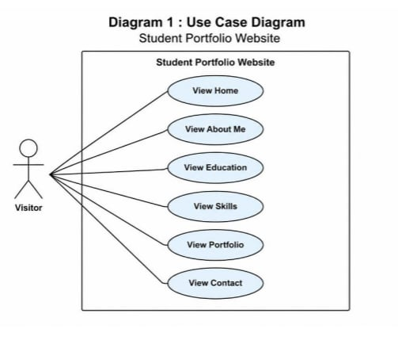
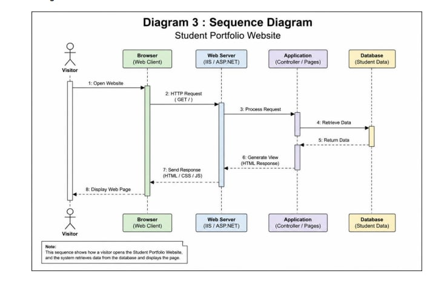

# Homework 8 : Personal Homepage

## Student Info

**Name :** นางสาว วิภาวี พรมสุข

**Student ID :** 6810301007

---

# Website Info

**Local Deployment (IIS)**

http://localhost:8080/

**Cloud Deployment (GitHub Pages)**

https://wipawee12.github.io/Homework8/

**GitHub Repository**

https://github.com/Wipawee12/Homework8

**Number of Pages**

8 Pages

## Menu Structure

- Home
- About
- CV
- Portfolio
- Skills
- Education
- Gallery
- Contact

---

# Pages Detail

## Home

**File Name**

`index.html`

**Description**

หน้าแรกของเว็บไซต์ แสดงข้อมูลแนะนำตัว รูปภาพ ข้อมูลการศึกษา และปุ่มเชื่อมไปยังหน้า CV และ Portfolio

### Code

```html
<!DOCTYPE html>
<html lang="th">

<head>
    <meta charset="UTF-8">
    <meta name="viewport" content="width=device-width, initial-scale=1.0">
    <title>Wipawee Promsuk | Portfolio</title>

    <link rel="stylesheet" href="css/style.css">
</head>

<body>

    <!-- Header -->
    <header>

        <div class="container">

            <nav>

                <h2 class="logo">Wipawee Promsuk</h2>

                <ul>

                    <li><a class="active" href="index.html">Home</a></li>

                    <li><a href="about.html">About</a></li>

                    <li><a href="cv.html">CV</a></li>

                    <li><a href="portfolio.html">Portfolio</a></li>

                    <li><a href="skills.html">Skills</a></li>

                    <li><a href="education.html">Education</a></li>

                    <li><a href="gallery.html">Gallery</a></li>

                    <li><a href="contact.html">Contact</a></li>

                </ul>

            </nav>

        </div>

    </header>

    <!-- Hero -->

    <section class="hero">

        <div class="container hero-content">

            <div class="hero-text">

                <h1>สวัสดีค่ะ 👋</h1>

                <h2>ฉันชื่อ วิภาวี พรมสุข</h2>

                <p>
                    นักศึกษาระดับปริญญาตรี ชั้นปีที่ 2
                    <br>
                    คณะเทคโนโลยีดิจิทัล
                    <br>
                    สาขาวิศวกรรมคอมพิวเตอร์
                    <br>
                    รหัสนักศึกษา 6810301007
                </p>

                <p>
                    สนใจการเรียนรู้ด้าน Hardware, Software,
                    Computer Networking
                    <br>
                    และมีความสนใจในการพัฒนาเว็บไซต์
                </p>

                <a href="cv.html" class="btn">
                    ดู CV
                </a>

                <a href="portfolio.html" class="btn btn-outline">
                    ผลงาน
                </a>

            </div>

            <div class="hero-image">

                

            </div>

        </div>

    </section>

    <!-- About Website -->

    <section class="about-site">

        <div class="container">

            <h2>เกี่ยวกับเว็บไซต์นี้</h2>

            <p>

                เว็บไซต์นี้จัดทำขึ้นเพื่อแนะนำตัว รวบรวมผลงาน
                ประวัติการศึกษา ทักษะ และช่องทางการติดต่อ
                โดยพัฒนาด้วย HTML5 และ CSS
                เพื่อใช้เป็นผลงานประกอบการเรียน
                รายวิชา Web Development

            </p>

        </div>

    </section>

</body>

</html>
```
---

## About

**File Name**

`about.html`

**Description**

แสดงข้อมูลส่วนตัว ความสนใจ งานอดิเรก และเป้าหมายในการศึกษา

### Code

```html
<!DOCTYPE html>
<html lang="th">

<head>
    <meta charset="UTF-8">
    <meta name="viewport" content="width=device-width, initial-scale=1.0">
    <title>About | Wipawee Promsuk</title>

    <link rel="stylesheet" href="css/style.css">
</head>

<body>

    <!-- Header -->
    <header>

        <div class="container">

            <nav>

                <h2 class="logo">Wipawee Promsuk</h2>

                <ul>

                    <li><a href="index.html">Home</a></li>

                    <li><a class="active" href="about.html">About</a></li>

                    <li><a href="cv.html">CV</a></li>

                    <li><a href="portfolio.html">Portfolio</a></li>

                    <li><a href="skills.html">Skills</a></li>

                    <li><a href="education.html">Education</a></li>

                    <li><a href="gallery.html">Gallery</a></li>

                    <li><a href="contact.html">Contact</a></li>

                </ul>

            </nav>

        </div>

    </header>

    <!-- About -->

    <section class="about-site">

        <div class="container">

            <h2>About Me</h2>

            <p>
                สวัสดีค่ะ ฉันชื่อ <strong>วิภาวี พรมสุข</strong>
                เป็นนักศึกษาระดับปริญญาตรี ชั้นปีที่ 2
                คณะเทคโนโลยีดิจิทัล
                สาขาวิศวกรรมคอมพิวเตอร์
            </p>

            <br>

            <h3>ความสนใจ</h3>

            <p>
                • Hardware<br>
                • Software<br>
                • Computer Networking<br>
                • Web Development
            </p>

            <br>

            <h3>งานอดิเรก</h3>

            <p>
                • ฟังเพลง<br>
                • ดูภาพยนตร์<br>
                • ศึกษาเทคโนโลยีใหม่ ๆ<br>
                • เล่นเกม<br>
            </p>

            <br>

            <h3>เป้าหมาย</h3>

            <p>
                ต้องการพัฒนาความรู้ด้านวิศวกรรมคอมพิวเตอร์
                เพื่อสร้างเว็บไซต์และระบบที่สามารถใช้งานได้จริง
                พร้อมทั้งพัฒนาทักษะการทำงานเป็นทีมและการแก้ปัญหา
            </p>

        </div>

    </section>

</body>

</html>

```

---

## CV

**File Name**

`cv.html`

**Description**

แสดงประวัติส่วนตัว ประวัติการศึกษา ทักษะ ผลงาน และข้อมูลการติดต่อ

### Code

```html
<!DOCTYPE html>
<html lang="th">

<head>
    <meta charset="UTF-8">
    <meta name="viewport" content="width=device-width, initial-scale=1.0">
    <title>CV | Wipawee Promsuk</title>

    <link rel="stylesheet" href="css/style.css">
</head>

<body>

    <!-- Header -->
    <header>

        <div class="container">

            <nav>

                <h2 class="logo">Wipawee Promsuk</h2>

                <ul>

                    <li><a href="index.html">Home</a></li>

                    <li><a href="about.html">About</a></li>

                    <li><a class="active" href="cv.html">CV</a></li>

                    <li><a href="portfolio.html">Portfolio</a></li>

                    <li><a href="skills.html">Skills</a></li>

                    <li><a href="education.html">Education</a></li>

                    <li><a href="gallery.html">Gallery</a></li>

                    <li><a href="contact.html">Contact</a></li>

                </ul>

            </nav>

        </div>

    </header>

    <!-- CV -->

    <section class="about-site">

        <div class="container">

            <h2>Curriculum Vitae (CV)</h2>

            <h3>ข้อมูลส่วนตัว</h3>

            <p>
                <strong>ชื่อ :</strong> วิภาวี พรมสุข <br>
                <strong>รหัสนักศึกษา :</strong> 6810301007 <br>
                <strong>คณะ :</strong> เทคโนโลยีดิจิทัล <br>
                <strong>สาขา :</strong> วิศวกรรมคอมพิวเตอร์
            </p>

            <br>

            <h3>การศึกษา</h3>

            <p>
                • ปัจจุบันกำลังศึกษาระดับปริญญาตรี ชั้นปีที่ 2 <br>
                คณะเทคโนโลยีดิจิทัล สาขาวิศวกรรมคอมพิวเตอร์
            </p>

            <br>

            <h3>Skills</h3>

            <p>
                • HTML5 <br>
                • CSS3 <br>
                • Python <br>
                • C++ <br>
                • Computer Network
            </p>

            <br>

            <h3>ประสบการณ์ / ผลงาน</h3>

            <p>
                • พัฒนาเว็บไซต์ Personal Homepage <br>
                • ออกแบบฐานข้อมูลด้วย ER Diagram <br>
                • ตั้งค่า VLAN และ DHCP ด้วย Cisco Packet Tracer
            </p>

            <br>

            <h3>ช่องทางการติดต่อ</h3>

            <p>
                Email : 6810301007@cdti.ac.th <br>
                Phone : 094-590-8078 <br>
                GitHub :
                <a href="https://github.com/Wipawee12/Homework8" target="_blank">
                    https://github.com/Wipawee12/Homework8
                </a>
            </p>

        </div>

    </section>

</body>

</html>

```
---

## Portfolio

**File Name**

`portfolio.html`

**Description**

แสดงผลงาน

- Homework 5 (URS)
- Homework 6 (UML Diagram)
- Homework 7 (IIS Setup)

พร้อมปุ่ม View และ Download

### Code

***
    ```html
    <!DOCTYPE html>
    <html lang="th">

    <head>
        <meta charset="UTF-8">
        <meta name="viewport" content="width=device-width, initial-scale=1.0">
        <title>Portfolio | Wipawee Promsuk</title>

        <link rel="stylesheet" href="css/style.css">
    </head>

    <body>

        <!-- Header -->
        <header>

            <div class="container">

                <nav>

                    <h2 class="logo">Wipawee Promsuk</h2>

                    <ul>

                        <li><a href="index.html">Home</a></li>

                        <li><a href="about.html">About</a></li>

                        <li><a href="cv.html">CV</a></li>

                        <li><a class="active" href="portfolio.html">Portfolio</a></li>

                        <li><a href="skills.html">Skills</a></li>

                        <li><a href="education.html">Education</a></li>

                        <li><a href="gallery.html">Gallery</a></li>

                        <li><a href="contact.html">Contact</a></li>

                    </ul>

                </nav>

            </div>

        </header>

        <!-- Portfolio -->

        <section class="about-site">

            <div class="container">

                <h2>Portfolio / Homework</h2>

                <p>
                    ผลงานและการบ้านที่ได้จัดทำในรายวิชา Web Development
                </p>

                <div class="portfolio-grid">

                    <!-- Homework 5 -->
                    <div class="portfolio-card">

                        <h3>Homework 5</h3>

                        <p>
                            <strong>User Requirement Specification (URS)</strong><br>
                            วิเคราะห์ความต้องการของระบบ POS
                            สำหรับร้าน Golden Place
                        </p>

                        <a href="files/HW5.pdf" class="btn" target="_blank">
                            View
                        </a>

                        <a href="files/HW5.pdf" class="btn btn-outline" download>
                            Download
                        </a>

                    </div>

                    <!-- Homework 6 -->
                    <div class="portfolio-card">

                        <h3>Homework 6</h3>

                        <p>
                            <strong>UML Diagrams</strong><br>
                            ออกแบบ Use Case Diagram
                            สำหรับ Student Portfolio Website
                        </p>

                        <a href="files/HW6.pdf" class="btn" target="_blank">
                            View
                        </a>

                        <a href="files/HW6.pdf" class="btn btn-outline" download>
                            Download
                        </a>

                    </div>

                    <!-- Homework 7 -->
                    <div class="portfolio-card">

                        <h3>Homework 7</h3>

                        <p>
                            <strong>IIS Setup</strong><br>
                            ติดตั้งและ Deploy
                            Student Portfolio Website บน IIS
                        </p>

                        <a href="files/HW7.pdf" class="btn" target="_blank">
                            View
                        </a>

                        <a href="files/HW7.pdf" class="btn btn-outline" download>
                            Download
                        </a>

                    </div>

                </div>

            </div>

        </section>

    </body>

    </html>
```
---

## Skills

**File Name**

`skills.html`

**Description**

แสดงทักษะด้าน

- HTML5
- CSS3
- Python
- C++
- Database
- Networking

### Code

```html
<!DOCTYPE html>
<html lang="th">

<head>
    <meta charset="UTF-8">
    <meta name="viewport" content="width=device-width, initial-scale=1.0">
    <title>Skills | Wipawee Promsuk</title>

    <link rel="stylesheet" href="css/style.css">
</head>

<body>

    <!-- Header -->
    <header>

        <div class="container">

            <nav>

                <h2 class="logo">Wipawee Promsuk</h2>

                <ul>

                    <li><a href="index.html">Home</a></li>

                    <li><a href="about.html">About</a></li>

                    <li><a href="cv.html">CV</a></li>

                    <li><a href="portfolio.html">Portfolio</a></li>

                    <li><a class="active" href="skills.html">Skills</a></li>

                    <li><a href="education.html">Education</a></li>

                    <li><a href="gallery.html">Gallery</a></li>

                    <li><a href="contact.html">Contact</a></li>

                </ul>

            </nav>

        </div>

    </header>

    <!-- Skills -->

<section class="about-site">

    <div class="container">

        <h2>Skills</h2>

        <p>ทักษะที่ได้เรียนรู้และพัฒนาในระหว่างการศึกษา</p>

        <div class="skill-card">

            <h3>Programming Languages</h3>

            <p>
                • HTML5 <br>
                • CSS3 <br>
                • Python <br>
                • C++
            </p>

        </div>

        <div class="skill-card">

            <h3>Database</h3>

            <p>
                • ER Diagram <br>
                • Database Design
            </p>

        </div>

        <div class="skill-card">

            <h3>Networking</h3>

            <p>
                • Network Topology <br>
                • IP Addressing <br>
                • Subnetting
            </p>

        </div>

    </div>

</section>

</body>

</html>

```

---

## Education

**File Name**

`education.html`

**Description**

แสดงประวัติการศึกษา

- มัธยมศึกษา
- ระดับปริญญาตรี

### Code

```html
<!DOCTYPE html>
<html lang="th">

<head>
    <meta charset="UTF-8">
    <meta name="viewport" content="width=device-width, initial-scale=1.0">
    <title>Education | Wipawee Promsuk</title>

    <link rel="stylesheet" href="css/style.css">
</head>

<body>

    <!-- Header -->
    <header>

        <div class="container">

            <nav>

                <h2 class="logo">Wipawee Promsuk</h2>

                <ul>

                    <li><a href="index.html">Home</a></li>

                    <li><a href="about.html">About</a></li>

                    <li><a href="cv.html">CV</a></li>

                    <li><a href="portfolio.html">Portfolio</a></li>

                    <li><a href="skills.html">Skills</a></li>

                    <li><a class="active" href="education.html">Education</a></li>

                    <li><a href="gallery.html">Gallery</a></li>

                    <li><a href="contact.html">Contact</a></li>

                </ul>

            </nav>

        </div>

    </header>

    <!-- Education -->

    <section class="about-site">

        <div class="container">

            <h2>Education</h2>

            <p>ประวัติการศึกษา</p>

            <div class="skill-card">

                <h3>ปัจจุบัน</h3>

                <p>
                    ระดับปริญญาตรี ชั้นปีที่ 2<br>
                    คณะเทคโนโลยีดิจิทัล<br>
                    สาขาวิศวกรรมคอมพิวเตอร์
                </p>

            </div>

            <div class="skill-card">

                <h3>มัธยมศึกษาตอนปลาย</h3>

                <p>
                    โรงเรียน หนองบัว
                </p>

            </div>

            <div class="skill-card">

                <h3>มัธยมศึกษาตอนต้น</h3>

                <p>
                    โรงเรียน หนองบัว
                </p>

            </div>

        </div>

    </section>

</body>

</html>

```

---

## Gallery

**File Name**

`gallery.html`

**Description**

แสดงรูปภาพนักศึกษาและรูปผลงาน พร้อมคำอธิบายใต้รูป

### Code

```html
<!DOCTYPE html>
<html lang="th">

<head>
    <meta charset="UTF-8">
    <meta name="viewport" content="width=device-width, initial-scale=1.0">
    <title>Gallery | Wipawee Promsuk</title>

    <link rel="stylesheet" href="css/style.css">
</head>

<body>

    <!-- Header -->
    <header>

        <div class="container">

            <nav>

                <h2 class="logo">Wipawee Promsuk</h2>

                <ul>

                    <li><a href="index.html">Home</a></li>

                    <li><a href="about.html">About</a></li>

                    <li><a href="cv.html">CV</a></li>

                    <li><a href="portfolio.html">Portfolio</a></li>

                    <li><a href="skills.html">Skills</a></li>

                    <li><a href="education.html">Education</a></li>

                    <li><a class="active" href="gallery.html">Gallery</a></li>

                    <li><a href="contact.html">Contact</a></li>

                </ul>

            </nav>

        </div>

    </header>

    <!-- Gallery -->

    <section class="about-site">

        <div class="container">

            <h2>Gallery</h2>

            <p>รูปภาพกิจกรรมและผลงาน</p>

            <div class="gallery-grid">

    <div class="gallery-card">

        

        <h3>รูปนักศึกษา</h3>

        <p>รูปประจำตัวสำหรับแนะนำตัวในเว็บไซต์</p>

    </div>

    <div class="gallery-card">

        

        <h3>รูปผลงาน</h3>

        <p>ภาพตัวอย่างผลงานและการบ้านที่ได้จัดทำ</p>

    </div>

    <div class="gallery-card">

        

        <h3>รูปประกอบ</h3>

        <p>ภาพประกอบที่ใช้ตกแต่งเว็บไซต์</p>

    </div>

</div>
</section>

</body>

</html>

```

---

## Contact

**File Name**

`contact.html`

**Description**

แสดงข้อมูลการติดต่อ

- Email
- Phone
- GitHub
- Website

พร้อม Contact Form

### Code

```html
<!DOCTYPE html>
<html lang="th">

<head>
    <meta charset="UTF-8">
    <meta name="viewport" content="width=device-width, initial-scale=1.0">
    <title>Contact | Wipawee Promsuk</title>

    <link rel="stylesheet" href="css/style.css">
</head>

<body>

    <!-- Header -->
    <header>

        <div class="container">

            <nav>

                <h2 class="logo">Wipawee Promsuk</h2>

                <ul>

                    <li><a href="index.html">Home</a></li>

                    <li><a href="about.html">About</a></li>

                    <li><a href="cv.html">CV</a></li>

                    <li><a href="portfolio.html">Portfolio</a></li>

                    <li><a href="skills.html">Skills</a></li>

                    <li><a href="education.html">Education</a></li>

                    <li><a href="gallery.html">Gallery</a></li>

                    <li><a class="active" href="contact.html">Contact</a></li>

                </ul>

            </nav>

        </div>

    </header>

    <!-- Contact -->

    <section class="about-site">

        <div class="container">

            <h2>Contact</h2>

            <p>หากต้องการติดต่อ สามารถส่งข้อความผ่านแบบฟอร์มด้านล่าง</p>

            <form class="contact-form">

                <label>ชื่อ</label>
                <input type="text" placeholder="กรอกชื่อ">

                <label>Email</label>
                <input type="email" placeholder="example@email.com">

                <label>ข้อความ</label>
                <textarea rows="6" placeholder="กรอกข้อความ"></textarea>

                <button type="submit" class="btn">Send Message</button>

            </form>

        </div>

    </section>

</body>

</html>

```

---

# CSS

ใช้ไฟล์

```text
css/style.css
```

### Code

```html
/* ===========================
   RESET
=========================== */

*{
    margin:0;
    padding:0;
    box-sizing:border-box;
}

html{
    scroll-behavior:smooth;
}

/* ===========================
   BODY
=========================== */

body{
    font-family:Arial, Helvetica, sans-serif;
    background:#F5F5F5;
    color:#111111;
    line-height:1.6;
}

/* ===========================
   CONTAINER
=========================== */

.container{
    width:90%;
    max-width:1200px;
    margin:auto;
}

/* ===========================
   HEADER
=========================== */

header{
    background:#FFFFFF;
    position:sticky;
    top:0;
    z-index:999;
    box-shadow:0 3px 10px rgba(0,0,0,.08);
}

/* ===========================
   NAVBAR
=========================== */

nav{
    display:flex;
    justify-content:space-between;
    align-items:center;
    height:80px;
}

.logo{
    color:#111111;
    font-size:30px;
    font-weight:bold;
    transition:.3s;
}

.logo:hover{
    color:#C1121F;
}

nav ul{
    display:flex;
    list-style:none;
}

nav li{
    margin-left:18px;
}

nav a{
    text-decoration:none;
    color:#111111;
    padding:10px 15px;
    border-radius:8px;
    font-weight:600;
    transition:.3s;
}

nav a:hover{
    background:#C1121F;
    color:white;
}

.active{
    background:#C1121F;
    color:white;
}

/* ===========================
   HERO
=========================== */

.hero{
    padding:90px 0;
    animation:fadeUp .8s ease;
}

.hero-content{
    display:flex;
    justify-content:space-between;
    align-items:center;
    gap:40px;
}

.hero-text{
    flex:1;
}

.hero-text h1{
    font-size:48px;
    color:#C1121F;
}

.hero-text h2{
    font-size:40px;
    margin:20px 0;
}

.hero-text p{
    margin-bottom:18px;
    color:#555;
    font-size:18px;
}

.hero-image{
    flex:1;
    text-align:center;
}

.hero-image img{
    width:280px;
    border-radius:15px;
    border:5px solid white;
    box-shadow:0 10px 20px rgba(0,0,0,.15);
    transition:.3s;
}

.hero-image img:hover{
    transform:scale(1.05);
}

/* ===========================
   BUTTON
=========================== */

.btn{
    display:inline-block;
    margin-top:15px;
    margin-right:10px;
    padding:12px 28px;
    background:#C1121F;
    color:white;
    text-decoration:none;
    border-radius:8px;
    transition:.3s;
    font-weight:bold;
}

.btn:hover{
    background:#111111;
}

.btn-outline{
    background:white;
    color:#C1121F;
    border:2px solid #C1121F;
}

.btn-outline:hover{
    background:#C1121F;
    color:white;
}

/* ===========================
   ABOUT WEBSITE
=========================== */

/* ===========================
   ABOUT WEBSITE
=========================== */

.about-site{
    background:white;
    padding:80px 0;
    margin-top:40px;
}

.about-site h2{
    border-left:6px solid #C1121F;
    padding-left:15px;
    margin-bottom:20px;
    font-size:34px;
}

.about-site p{
    color:#555;
    font-size:18px;
    line-height:1.8;
}

/* ===========================
   ANIMATION
=========================== */

@keyframes fadeUp{

    from{
        opacity:0;
        transform:translateY(40px);
    }

    to{
        opacity:1;
        transform:translateY(0);
    }

}

/* ===========================
   RESPONSIVE
=========================== */

@media(max-width:900px){

    nav{
        flex-direction:column;
        height:auto;
        padding:20px 0;
    }

    nav ul{
        margin-top:15px;
        flex-wrap:wrap;
        justify-content:center;
    }

    .hero-content{
        flex-direction:column;
        text-align:center;
    }

    .hero-image img{
        width:220px;
    }

}
/* ===========================
   PORTFOLIO
=========================== */

.portfolio-grid{
    display:grid;
    grid-template-columns:repeat(auto-fit,minmax(300px,1fr));
    gap:25px;
    margin-top:30px;
}

.portfolio-card{
    background:#FFFFFF;
    padding:25px;
    border-radius:10px;
    box-shadow:0 5px 15px rgba(0,0,0,.1);
    transition:.3s;
}

.portfolio-card:hover{
    transform:translateY(-5px);
}

.portfolio-card h3{
    color:#C1121F;
    margin-bottom:15px;
}

.portfolio-card p{
    color:#555;
    margin-bottom:20px;
    line-height:1.7;
}
/* ===========================
   SKILLS
=========================== */

.skill-card{
    background:#FFFFFF;
    padding:20px;
    margin-top:20px;
    margin-bottom:20px;
    border-left:5px solid #C1121F;
    border-radius:10px;
    box-shadow:0 5px 15px rgba(0,0,0,.08);
    transition:.3s;
}

.skill-card:hover{
    transform:translateY(-5px);
}

.skill-card h3{
    color:#C1121F;
    margin-bottom:12px;
}

.skill-card p{
    color:#555;
    line-height:1.8;
}
/* ===========================
   GALLERY
=========================== */

.gallery-grid{
    display:grid;
    grid-template-columns:repeat(auto-fit,minmax(250px,1fr));
    gap:20px;
    margin-top:30px;
}

.gallery-card{
    background:#FFFFFF;
    padding:15px;
    border-radius:10px;
    box-shadow:0 5px 15px rgba(0,0,0,.1);
    text-align:center;
    transition:.3s;
}

.gallery-card:hover{
    transform:translateY(-5px);
}

.gallery-card img{
    width:220px;
    height:220px;
    object-fit:cover;
    display:block;
    margin:0 auto;
    border-radius:10px;
}

.gallery-card h3{
    color:#C1121F;
    margin:15px 0 10px;
}

.gallery-card p{
    color:#555;
    font-size:16px;
    line-height:1.6;
}
/* ===========================
   CONTACT
=========================== */

.contact-form{
    max-width:700px;
    margin-top:30px;
}

.contact-form label{
    display:block;
    margin:15px 0 8px;
    font-weight:bold;
}

.contact-form input,
.contact-form textarea{

    width:100%;
    padding:12px;
    border:1px solid #ccc;
    border-radius:8px;
    font-size:16px;
}

.contact-form textarea{
    resize:vertical;
}

.contact-form button{
    margin-top:20px;
    border:none;
    cursor:pointer;
}

```

---

# Features Checklist

| Feature | Status |
|----------|:------:|
| Homepage | ✅ |
| Navigation Menu | ✅ |
| Portfolio | ✅ |
| Contact Form | ✅ |
| CV Page | ✅ |
| Images | ✅ |
| Responsive Layout | ✅ |
| External CSS | ✅ |

---

# Cloud Deployment

**Platform**

GitHub Pages

**Public URL**

https://wipawee12.github.io/Homework8/

**Repository**

https://github.com/Wipawee12/Homework8

**Description**

เว็บไซต์ Personal Homepage พัฒนาด้วย HTML5 และ CSS ประกอบด้วยทั้งหมด 8 หน้า และเผยแพร่ผ่าน GitHub Pages เพื่อให้สามารถเข้าถึงได้ผ่านอินเทอร์เน็ต

**Status**

✅ Completed